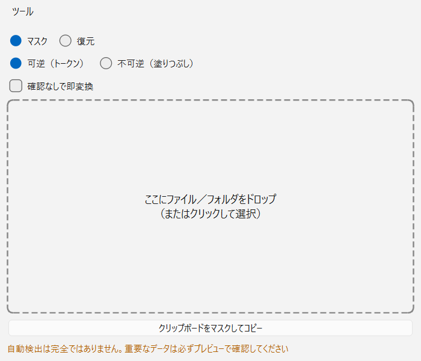

# 04. 画面構成・運用

> 関連文書: [README（目次・用語集）](README.md) / [01 概要・要件](01-overview.md) /
> [02 アーキテクチャ](02-architecture.md) / [03 マスク仕様](03-masking-spec.md) /
> [05 現状の課題・将来拡張](05-known-issues-and-roadmap.md)

画面の挙動、エラー時の振る舞い、テスト方針、ビルド・配布の担保をまとめる。

---

## 6. 画面構成

### 6.1 メイン画面

- 中央: ドラッグ&ドロップゾーン（ファイル複数可・フォルダ可）
- モード切替: マスク ／ 復元
- マスク方式: 可逆（トークン） ／ 不可逆（塗りつぶし）
- チェックボックス: 「確認なしで即変換」
- クリップボード操作: 「貼り付け→マスク→コピー」ワンクリックボタン（復元モードでは貼り付け→復元→コピー）
- 常時注記: 「自動検出は完全ではありません。重要なデータは必ずプレビューで確認してください」

### 6.2 プレビュー画面

- 左ペイン: 原文表示。検出箇所を種別ごとに色分けハイライト
- 右ペイン: 検出一覧（種別・値・件数）。チェックボックスで個別除外、種別単位の一括除外
- 手動追加: 左ペインでテキスト範囲選択 → 右クリック → 種別を選んで追加（断片の境界をまたぐ選択は警告して拒否）
- フォルダ一括時: ファイルごとにタブ表示（多数の場合は確認なしモードを促す）
- 確定ボタンで置換実行（手動追加分も含めて[03 §4.2](03-masking-spec.md) の重複解決を通してから置換）

### 6.3 設定画面

- カスタム辞書編集: 語句＋種別の表形式編集、CSVインポート／エクスポート（列: `語句, 種別`、UTF-8 BOM付き、
  重複語句はインポート時に警告）。種別は固定語彙からプルダウン選択（自由入力による誤カテゴリを防止）。
- 検出カテゴリのON/OFF（例: 地名を検出しない）。※カスタム辞書由来の検出はこの設定の影響を受けない（[03 §4.3](03-masking-spec.md)）
- 出力先設定: 元ファイルと同じフォルダ（既定） ／ 固定フォルダ
- 設定・辞書の保存先: `%APPDATA%/PrivacyProtection/`（JSON）

### 6.4 処理後レポート（即変換時の安全担保）

マスク実行後（プレビュー経由・即変換とも）、必ずレポートを表示する。

- ファイルごとの検出件数・種別内訳（例: 人名5件、電話番号2件）
- **検出0件のファイルを強調表示**し、「検出漏れの可能性があります。内容を確認してください」と注記
- マスク対象外の要素（図形内テキスト等）が存在したファイルの注記（[03 §4.6](03-masking-spec.md) の対象外箇所）
- スキップされたファイル一覧（未対応拡張子・エラー）
- フォルダ一括時は同内容を `_report.txt` としてルートに出力
- レポートには**元の値そのものは記載しない**（件数・種別のみ。値の確認はプレビューまたは対応表で行う）

---

## 7. エラー処理

| ケース | 挙動 |
|--------|------|
| パスワード付き・破損Officeファイル | スキップし、処理完了後にレポートで表示（一括処理は継続） |
| エンコーディング判定不能なテキストファイル | スキップし、レポートで表示 |
| 未対応拡張子（フォルダ一括時） | スキップし、件数と一覧をレポートに表示 |
| 復元時に対応表にないトークン／残存トークン | そのまま残し、警告一覧に表示 |
| 原文に既存のトークン形式文字列 | 警告表示し、連番をその後ろから開始（[03 §4.4](03-masking-spec.md)） |
| 巨大ファイル | ワーカースレッドで処理、進捗バー表示、キャンセル可能 |
| 出力先に同名ファイルが存在 | 連番付与（`_masked(2)` 等）で上書きしない |
| クラッシュ・キャンセル | 一時ファイル方式により部分書き込みを残さない（[02 §5.3](02-architecture.md)） |
| GUI操作中の想定外入力（未対応拡張子・ファイルとフォルダ混在ドロップ・壊れた対応表） | 例外を捕捉しエラーダイアログを表示（アプリはクラッシュしない） |

エラーメッセージ・ログにはファイルパスと理由のみを記録し、**検出された値そのものは記録しない**。

---

## 8. テスト方針

- コア層（Detector / Masker / Restorer）: pytest でユニットテスト
  - パターン検出: 各PII種別の正例・負例（形式は正しいが無効な番号等の境界ケースを含む）
  - 重複解決: [03 §4.2](03-masking-spec.md) のルールを網羅するケース
  - トークン一貫性: 同一値→同一トークン、フォルダ一括での横断一貫性
  - トークン衝突: 原文にトークン形式文字列が含まれるケース
  - **ラウンドトリップ: マスク→復元で原文と完全一致することを全対応形式・全エンコーディング（UTF-8/CP932/改行コード違い）で検証**
  - 復元: AIがトークンを改変したケースで誤復元しない（未知トークン警告になる）こと
- ファイルI/O層: 実ファイルフィクスチャ（xlsx/docx/pptx/txt/csv）で書式保持・対象範囲（[03 §4.6](03-masking-spec.md)）を検証
- NER: 精度そのものはテストせず、「検出結果がDetection形式で返る」結合レベルの確認に留める
- レポート: 検出0件ファイルの強調・スキップ一覧の表示を検証
- GUI: 自動テストは持たず手動確認中心。ただし `QT_QPA_PLATFORM=offscreen` を用いたヘッドレススクリプトで、
  ドロップ/クリックが呼ぶ内部ハンドラを直接叩く形の検証を行っている。

> 実行コマンド等の環境情報は `CLAUDE.md` の「Commands」節を参照（Python 3.11 / venv / pytest）。

---

## 9. 配布・実行環境の保証

### 9.1 「ネットワーク通信をしない」の担保

- ネットワーク通信を行うライブラリ・コードを一切含めない（NERモデルは配布物に同梱し、実行時ダウンロードをしない）
- 依存ライブラリの実行時通信（spaCyのテレメトリ等）は設定で無効化し、ビルド時に確認する
- リリース前チェックで、`socket` / `urllib` / `requests` 等のネットワークAPI呼び出しが自社コードに含まれない
  ことを静的検査する（`tests/test_no_network.py` が `src/` を走査）
- 追加の保証が必要な環境では、Windows Firewall でアプリの外向き通信をブロックする運用を配布手順書に記載する

### 9.2 パッケージング

- PyInstaller によるビルド（GiNZAモデル同梱、想定サイズ 500MB前後）。`scripts/build.ps1` で実行。
- 起動時間短縮のため one-folder 形式を第一候補とし、one-file（単体exe）は起動速度を検証の上で判断
- インストーラー不要（ZIP展開のみで動作）
- 配布ZIPには SHA-256 ハッシュを添付し、改ざん確認に使えるようにする
