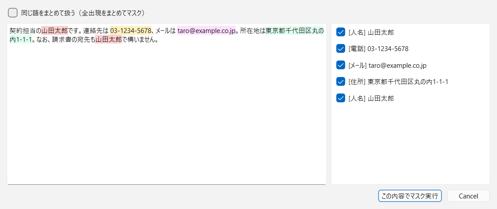
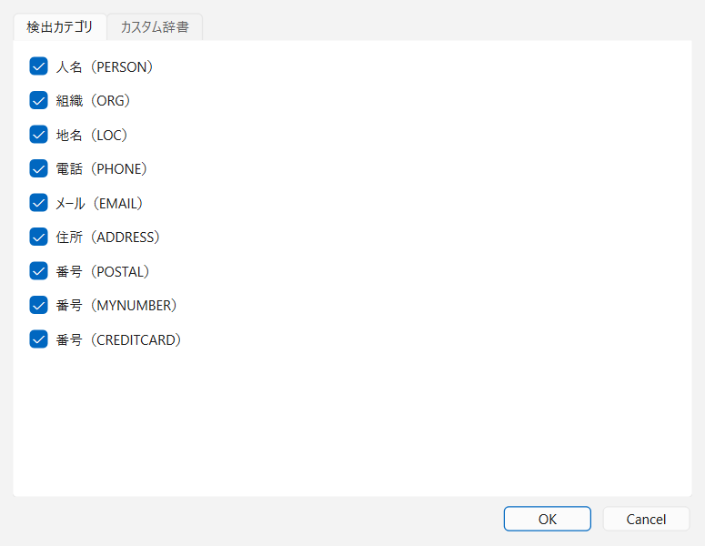
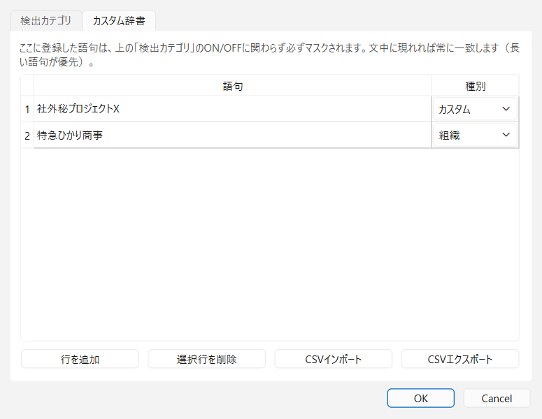
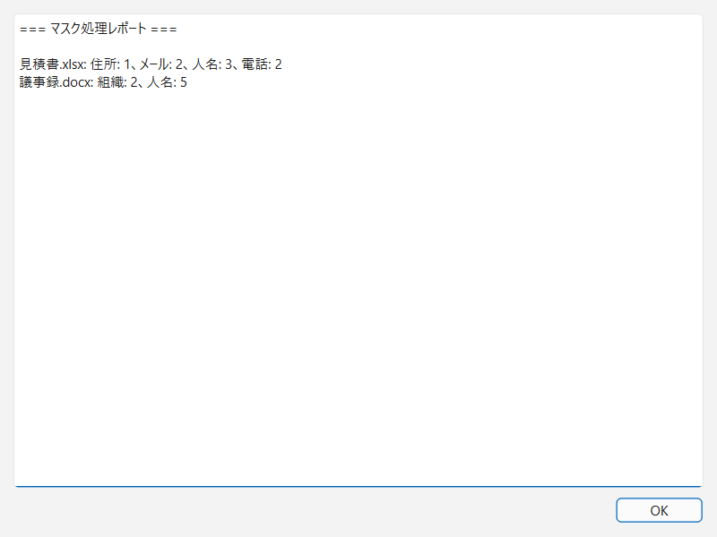

# 04. 画面構成・運用

> 関連文書: [README（目次・用語集）](README.md) / [01 概要・要件](01-overview.md) /
> [02 アーキテクチャ](02-architecture.md) / [03 マスク仕様](03-masking-spec.md) /
> [05 現状の課題・将来拡張](05-known-issues-and-roadmap.md)

画面の挙動、エラー時の振る舞い、テスト方針、ビルド・配布の担保をまとめる。

---

## 4.1 メイン画面

- 中央: ドロップゾーン（画面の大半を占める主役）。ドラッグ&ドロップ（ファイル複数可・フォルダ可）、
  クリックでのファイル選択ダイアログ、Ctrl+V でのクリップボード処理を受け付ける。案内文に Ctrl+V の
  存在を明記する
- クリップボード操作ボタン: ラベルは常に「クリップボードを処理してコピー」で固定。マスクと復元の
  どちらを行うかはボタンではなく後述の自動判定が決める
- Ctrl+V ショートカット: クリップボードボタンと同じ処理を起動する
- 詳細設定（折りたたみパネル）: 既定は折りたたみ。ヘッダーには畳んだ状態でも現在の設定を要約表示し
  （例:「▸ 詳細設定（不可逆マスク・即変換）」）、既定（自動判定・可逆・確認あり）から変えている場合は
  ヘッダーを強調色にする。開いたときの内容:
  - 動作: 自動判定（既定） ／ 常にマスク ／ 常に復元
  - 方式: 可逆（トークン） ／ 不可逆（塗りつぶし）
  - チェックボックス: 「確認なしで即変換」
  - 「設定…」「辞書を編集…」ボタン: いずれも設定画面（§4.3）を開く。「辞書を編集…」はカスタム辞書
    タブを選択した状態で開く。同じ画面へは「ツール」メニューからも辿れる
  - パネルの内容（動作・方式・確認要否）と開閉状態は設定ファイルに永続化され、次回起動時にも
    そのまま復元する
- 進捗バー: フォルダ一括処理（マスク・復元とも）中のみ表示。処理中は操作を無効化し、前の処理の完了前に
  次を始めさせない
- 常時注記: 「自動検出は完全ではありません。重要なデータは必ずプレビューで確認してください」

### 意図の自動判定

ドロップ・貼り付けされた対象がマスク済みかどうかを、決定的なルールのみで判定する。

- テキスト: トークン（`【種別_n】`）を含めば復元を提案し、なければマスクを提案する
- ファイル: `<ファイル名>.pmap.csv` が隣にある／`*_masked` 命名かつ `_folder.pmap.csv` が隣にある／
  断片テキストにトークンを含む、のいずれかで復元を提案し、それ以外はマスクを提案する
- フォルダ: 直下に `_folder.pmap.csv` があれば一括復元を提案し（対象は `*_masked` 命名のファイルのみ）、
  なければ一括マスクを提案する
- 復元の提案は必ず確認ダイアログを挟み、「いいえ」を選ぶとマスクにフォールバックする
- 詳細設定の「動作」（自動判定／常にマスク／常に復元）で判定を固定できる。固定時はこの判定を行わず、
  確認ダイアログも出さない

ドロップされた対象によって経路が分かれる。

| 対象 | 挙動 |
|---|---|
| フォルダ1つ（マスクの判定） | ワーカースレッドで一括マスク。プレビューは通らず、完了後に処理後レポート（§4.4）を表示 |
| フォルダ1つ（復元の判定） | ワーカースレッドで一括復元し、完了後に件数と警告を表示。対応表はファイルごとの`.pmap.csv`（サイドカー）があれば優先し、なければ共有の`_folder.pmap.csv`を使う |
| ファイル（マスクの判定、「確認なしで即変換」OFF） | ファイルごとにプレビュー（§4.2）→ 確定したものだけマスクし、ファイルごとにレポートを表示 |
| ファイル（マスクの判定、「確認なしで即変換」ON） | プレビューを飛ばして即マスクし、ファイルごとにレポートを表示 |
| ファイル（復元の判定） | 対応表を自動検出して復元し、完了ダイアログを表示 |

## 4.2 プレビュー画面

マスク実行前に検出結果を目視・編集する画面。ファイルのマスクとクリップボードのマスクの両方が同じ
画面を通る（「確認なしで即変換」ON時のみ省略）。クリップボードのマスクをここでキャンセルした場合、
クリップボードは変更しない。

- **左ペイン**: 原文表示（読み取り専用）。検出箇所を種別ごとに色分けハイライト
- **右ペイン**: 検出一覧。チェックボックスで有効／無効を切り替え、右クリックで種別を変更する
- 確定ボタンで置換実行（手動追加分も含めて[03 §3.1](03-masking-spec.md)の重複解決を通してから置換）

### 左ペインの直接操作

| 操作 | 結果 |
|---|---|
| ドラッグで範囲選択 | 選択範囲を**カスタム**の手動検出として即追加する（種別の変更は右ペインで行う） |
| ハイライトをクリック | その検出のマスクON/OFFをトグルする。無効化しても範囲自体は保持されるため、同じ場所をもう一度クリックすれば戻る |
| ハイライトでない箇所をクリック | 何もしない |

- 既存の検出の上での1文字以下の選択は、クリックしようとして数ピクセル動いた操作とみなし、追加ではなく
  トグルとして扱う。
- 選択が段落・セルなどの断片境界をまたぐ場合は、**黙って切り詰めず警告して中止**する。境界で切り詰めると
  ユーザーが選んだ範囲の一部が記録されないまま確定し、気づかれないマスク漏れになるため。
- 手動追加は常に `Detection.text == 断片テキスト[start:end]` を満たす形で作る
  （[02 §2.3](02-architecture.md)）。

### 「同じ語をまとめて扱う」モード

画面上部のチェックボックス（既定OFF）で、**表示粒度と操作粒度をまとめて**切り替える。片方だけ値単位に
すると「行はチェック済みなのに一部の出現だけ無効」という不整合が生じるため、常に一致させる。

| 操作 | OFF（既定・個別） | ON（まとめて） |
|---|---|---|
| 一覧表示 | 出現ごとに1行 | 同じ `(値, 種別)` を1行に集約し、2件以上なら `×N` を付す |
| ドラッグ追加 | 選択した1箇所だけ | 選択した語の全断片・全出現をカスタムとして追加 |
| ハイライトのクリック | その1箇所をトグル | 同じ値の全出現をまとめてトグル |
| 一覧のチェック切替 | その1件のみ | 同じ値の全出現に適用 |
| 種別変更（一覧の右クリック） | その1件のみ | 同じ値の全出現に適用 |

- 全出現への展開は**ユーザーが明示的にドラッグ追加した語**に限る。自動検出（パターン/辞書/NER）の結果を
  遡って展開はしない。短い語が別の語の一部に一致してしまう過剰マスクを避けるため。
- 一致は完全一致のみで、あいまい一致・正規化一致はしない。
- モードの状態は永続化せず、プレビューを開くたびOFFに戻る。
- ONで追加した検出も通常の検出スパンとして持つため、OFFへ戻すと個別の行として現れる。
- どちらのモードでも、同一の値には同一トークンが割り当てられる（[03 §3.3](03-masking-spec.md)）。この
  モードが変えるのは表示と編集の粒度だけである。

## 4.3 設定画面

タブ構成。「設定」ボタンは検出カテゴリタブ、「辞書を編集」ボタンはカスタム辞書タブを開いた状態で
表示する。設定・辞書の保存先は `%APPDATA%/PrivacyProtection/`（JSON）。

**検出カテゴリタブ** — 検出カテゴリのON/OFF（例: 地名を検出しない）。カスタム辞書由来の検出は
この設定の影響を受けない（[03 §3.2](03-masking-spec.md)）。

**カスタム辞書タブ** — 語句＋種別の表形式編集。種別は固定語彙からプルダウン選択する（自由入力による
誤カテゴリを防止）。CSVインポート／エクスポート（列: `語句, 種別`、UTF-8 BOM付き）に対応し、重複語句は
インポート時に警告する。

## 4.4 処理後レポート（即変換時の安全担保）

マスク実行後（プレビュー経由・即変換とも）、必ずレポートを表示する。

- ファイルごとの検出件数・種別内訳（例: 人名5件、電話番号2件）
- **検出0件のファイルを強調表示**し、「検出漏れの可能性があります。内容を確認してください」と注記
- マスク対象外の要素（図形内テキスト等）が存在したファイルの注記（[03 §3.6](03-masking-spec.md)の対象外箇所）
- スキップされたファイル一覧（未対応拡張子・エラー）
- フォルダ一括時は同内容を `_report.txt` としてルートに出力
- レポートには**元の値そのものは記載しない**（件数・種別のみ。値の確認はプレビューまたは対応表で行う）

クリップボードのマスクだけは、レポート画面ではなく件数を示す完了ダイアログを表示する（検出0件のときは
検出漏れの可能性を注記する）。対応表は `%APPDATA%/PrivacyProtection/clipboard.pmap.csv` に出力し、
その場所を完了ダイアログに表示する。

---

## 4.5 エラー処理

| ケース | 挙動 |
|--------|------|
| パスワード付き・破損Officeファイル | スキップし、処理完了後にレポートで表示（一括処理は継続） |
| エンコーディング判定不能なテキストファイル | スキップし、レポートで表示 |
| 未対応拡張子（フォルダ一括時） | スキップし、件数と一覧をレポートに表示 |
| 復元時に対応表にないトークン／残存トークン | そのまま残し、警告一覧に表示 |
| 復元時に対応表が見つからない | 同じフォルダの `_folder.pmap.csv` を探し、無ければファイル選択ダイアログで指定させる |
| 原文に既存のトークン形式文字列 | 警告表示し、連番をその後ろから開始（[03 §3.3](03-masking-spec.md)） |
| フォルダ一括処理（マスク・復元とも） | ワーカースレッドで処理し、進捗バーを表示する。処理中は操作を無効化する（→ 中断手段は[05 E-3](05-known-issues-and-roadmap.md)） |
| 出力先に同名ファイルが存在 | 連番付与（`_masked(2)` 等）で上書きしない |
| クラッシュ・キャンセル | 一時ファイル方式により部分書き込みを残さない（[02 §2.7](02-architecture.md)） |
| GUI操作中の想定外入力（未対応拡張子・ファイルとフォルダ混在ドロップ・壊れた対応表） | 例外を捕捉しエラーダイアログを表示する。複数ファイル処理では1件の失敗で残りを巻き込まない |

エラーメッセージ・ログにはファイルパスと理由のみを記録し、**検出された値そのものは記録しない**。

## 4.6 テスト方針

- コア層（Detector / Masker / Restorer / spans）: pytest でユニットテスト
  - パターン検出: 各PII種別の正例・負例（形式は正しいが無効な番号等の境界ケースを含む）
  - 重複解決: [03 §3.1](03-masking-spec.md)のルールを網羅するケース
  - トークン一貫性: 同一値→同一トークン、フォルダ一括での横断一貫性
  - トークン衝突: 原文にトークン形式文字列が含まれるケース
  - **ラウンドトリップ: マスク→復元で原文と完全一致することを全対応形式・全エンコーディング（UTF-8/CP932/改行コード違い）で検証**
  - 復元: AIがトークンを改変したケースで誤復元しない（未知トークン警告になる）こと
- ファイルI/O層: 実ファイルフィクスチャ（xlsx/docx/pptx/txt/csv）で書式保持・対象範囲（[03 §3.6](03-masking-spec.md)）を検証
- サービス層: パイプラインの入出力・原子性・レポート生成を検証
- NER: 精度そのものはテストせず、「検出結果がDetection形式で返る」結合レベルの確認に留める
- レポート: 検出0件ファイルの強調・スキップ一覧の表示を検証
- GUI: 自動テストは持たず手動確認中心。例外として、表示位置とPythonオフセットの変換表
  （`build_display_map`）だけは着色位置ずれに直結するためユニットテストを持つ。

> 実行コマンドは[`AGENTS.md`](../AGENTS.md)の「コマンド」節を参照（uv で管理）。

## 4.7 配布・実行環境の保証

### ネットワーク通信をしないことの担保

- ネットワーク通信を行うライブラリ・コードを一切含めない（NERモデルは配布物に同梱し、実行時ダウンロードをしない）
- 依存ライブラリの実行時通信（spaCyのテレメトリ等）は設定で無効化し、ビルド時に確認する
- リリース前チェックで、`socket` / `urllib` / `requests` 等のネットワークAPI呼び出しが自社コードに含まれない
  ことを静的検査する（`tests/test_no_network.py` が `src/` を走査）
- 追加の保証が必要な環境では、Windows Firewall でアプリの外向き通信をブロックする運用を配布手順書に記載する

### パッケージング

- PyInstaller によるビルド（GiNZAモデル同梱、想定サイズ 500MB前後）。`scripts/build.ps1` で実行する
- 起動時間短縮のため one-folder 形式を第一候補とし、one-file（単体exe）は起動速度を検証の上で判断する
- インストーラー不要（ZIP展開のみで動作）
- 配布ZIPには SHA-256 ハッシュを添付し、改ざん確認に使えるようにする
